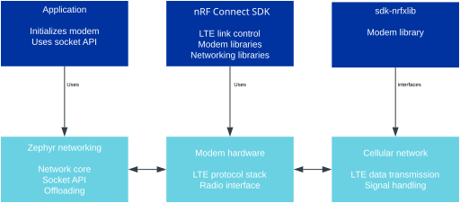

.. _lte_connectivity:

LTE connectivity
################

.. contents::
   :local:
   :depth: 2

LTE connectivity in Nordic Semiconductors' products, which integrates the Zephyr RTOS, is facilitated by following libraries that interconnect to provide seamless communication:

:ref:`nrfxlib:nrf_modem`
  The Modem library is a crucial component that allows applications to interface with the modem core on the nRF91 Series SiP.
  It is a set of standard function calls that can be used in your application to communicate with the modem.
  The library implements communication through the Remote Procedure Call (RPC) library, using the Inter Processor Communication (IPC) peripheral and a shared region of RAM.
  The Modem library contains the AT interface, DECT physical layer (PHY) interface, bootloader APIs, socket APIs, Delta DFU APIs, GNSS APIs, softSIM APIs, and modem trace APIs, which interface with their respective modules in the modem firmware.

:ref:`nrf_modem_lib_readme`
  This layer integrates the :ref:`nrfxlib:nrf_modem` into the |NCS|.
  It consists of the library wrapper, and functionalities like socket offloading, OS abstraction, memory reservation by the Partition manager, handling modem traces, and diagnostics.
  The integration layer uses the functionality to redirect all socket API calls to the Modem library’s native socket API, thereby offloading all socket calls to the IP stack in the nRF91 Series modem firmware.

:ref:`lte_lc_readme`
  This is a library in the |NCS| that is used by various other libraries and samples for managing the LTE link.
  The library simplifies the use of the modem library for establishing and maintaining an LTE connection.
  It uses the AT command interface to control the modem.

Zephyr Libraries
  Zephyr libraries like CoAP, :ref:`CoAP Client <zephyr:coap_client_interface>`, :ref:`zephyr:net_mgmt_interface`, and network interface are used in conjunction with the |NCS| libraries to provide comprehensive networking capabilities.

  Zephyr provides the networking stack and infrastructure needed for IP-based communication:

  * Network core- The core networking stack that provides IP connectivity, including IPv4/IPv6, UDP/TCP, and other networking protocols.
  *	Socket API- Zephyr's socket API is used by applications to create network connections.
    In the context of LTE, this API is mapped to the :ref:`nrfxlib:nrf_modem` provided by `sdk-nrfxlib`_ to communicate over the LTE link.
  * Offloading- In some cases, certain network functionalities are offloaded to the modem, meaning the modem itself handles these functionalities instead of the Zephyr stack.
    This can include tasks like TCP/IP processing, which can be managed by the modem's firmware.

Networking Libraries
  The |NCS| also includes libraries for networking that are used for cellular IoT.
  These include :ref:`lib_modem` and :ref:`lib_networking`.

These libraries work together to provide LTE connectivity in Nordic Semiconductors' products.

Interconnection Overview
************************

The interaction of the libraries with an LTE-connected application is as follows:

#. The application starts by initializing the modem using the :ref:`nrfxlib:nrf_modem`.
#. It then uses the LTE Link Control library to establish an LTE connection, which in turn uses the AT Command Interface to communicate with the modem.
#. Once the LTE link is established, the application can use Zephyr's Socket API to create network connections.
   These calls are mapped to the Modem library, which translates them into modem-specific commands and actions.
#. The modem firmware handles the actual LTE communication, including connecting to the cellular network, data transmission, and reception.
#. The application can use additional |NCS| libraries to manage the modem, retrieve information, and parse AT command responses.
   Throughout this process, the application relies on the underlying Zephyr RTOS for task scheduling, interrupt handling, and other system-level functions.
   The |NCS| provides a cohesive environment where these components are integrated to offer a streamlined development experience for LTE-connected applications on Nordic Semiconductor's hardware.

The following figure shows a general overview of how LTE connectivity libraries interconnect with each other:

   LTE interconnection

LTE connection status and socket API interactions
=================================================

In the context of the nRF Connect SDK and Zephyr RTOS, there are specific mechanisms and events that can be used to determine the status of an LTE connection and the meaningfulness of interactions with the socket API.

Here's how you can monitor the connection status and ensure that socket interactions are meaningful:
To monitor LTE connection status, do the following:

#. Use :ref:`lte_lc_readme` - The library provides functions to control and monitor the LTE link.
   You can use this library to establish a connection with the network and to register a handler for connection events.
#. Event handling- Implement an event handler that listens for LTE link events.
   The LTE Link Control library can notify your application when the LTE link is up (connected) or down (disconnected).
   These events can be used to determine the current connection status.
#. AT command notifications- If you are using AT commands to interact with the modem, you can subscribe to unsolicited result codes (URCs) that indicate changes in the network status.
   For example, the ``+CEREG`` URC can inform you about network registration status changes.
#. Check network registration- You can periodically send AT commands like ``AT+CEREG?`` to check the network registration status and confirm that the device is still connected to the network.

To ensure socket interaction, do the following:

#. Check connection status- Before attempting to use the socket API for network communication, ensure that the LTE connection is established and that the device is registered with the network.
#. Handle socket errors- When using the socket API, check the return values of socket functions for errors.
   For instance, if a :c:func:`send` or :c:func:`recv` function returns an error, it may indicate that the connection is lost or there is some other issue that needs to be addressed.
   You can use the socket API to create a socket and connect to a server, for example, an echo server over UDP.
   The socket API is used by various libraries in the |NCS|, like the :ref:`lib_mqtt_helper` library and the CoAP library.
   However, these libraries do not use the socket API directly, the application needs to handle that.
#. Non-blocking sockets or polling: You can configure sockets to be non-blocking or use the :c:func:`poll` function to wait for a socket to be ready for reading or writing.
   This ensures that you don't perform socket operations when there is no data to be sent or received.
#. Implement reconnection logic: If the LTE connection is lost (for example, the event handler indicates a disconnection), implement logic to attempt reconnection.
   This may involve retrying the connection setup process using the LTE Link Control library.
#. Monitor signal quality- Monitoring signal quality (for example, using the ``AT+CSQ`` or the ``AT+CESQ`` command) can provide insights into the reliability of the connection.
   Poor signal quality may affect the success of socket operations.
#. Use keep-alive mechanisms: For long-lived connections, such as TCP, use keep-alive packets to ensure that the connection is still active and that intermediate network equipment does not close it due to inactivity.
